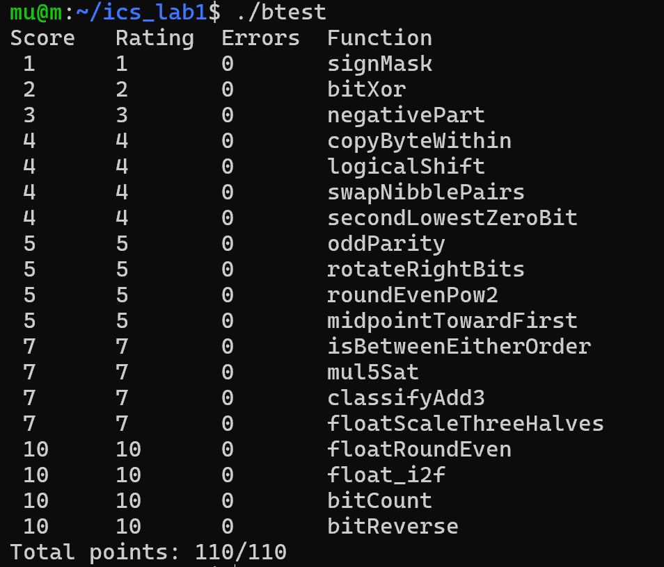
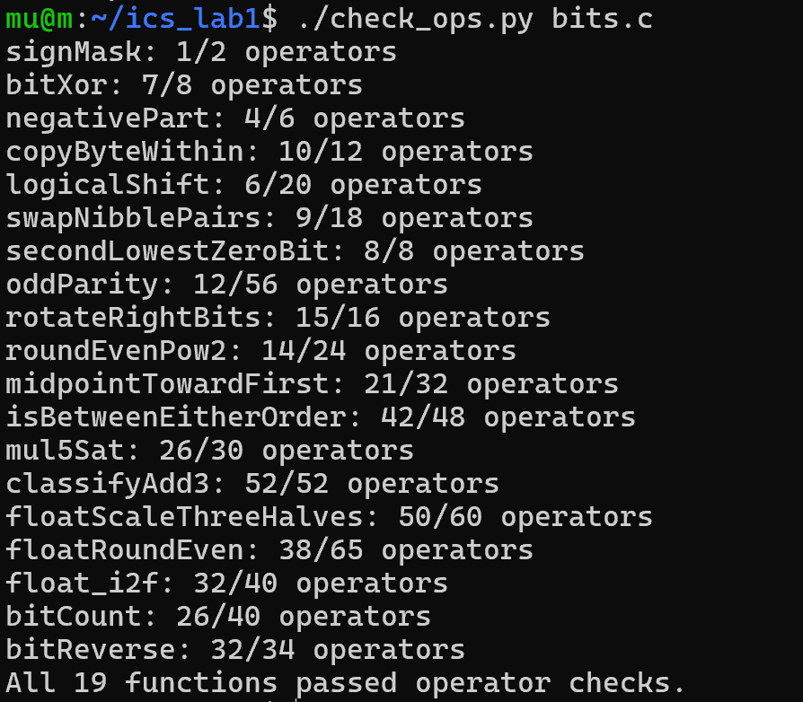

# Lab1 DataLab 实验报告

**姓名**：徐木紫　　**学号**：25303050009

## 一、
实验在 WSL2 Ubuntu 环境中完成，评测判据为两条：`./btest` 达到 110/110，且 `./check_ops.py bits.c` 十九题全部通过规则检查。最终结果如下。

## 二、测试结果截图

### 2.1 正确性测试 `./btest`

19 个函数的 `Errors` 均为 0，总分 `Total points: 110/110`。

### 2.2 规则检查 `./check_ops.py bits.c`

十九题的当前操作数均不超过各自的上限,末尾输出 `All 19 functions passed operator checks.`。

## 三、每题实现思路

### P1 `signMask`
用移位把最小的合法形式放到最高位：`1 << 31`，只消耗 1 个操作数。

### P2 `bitXor`

从集合的角度理解：`x ^ y` 是"两者中恰好一个为 1"的位，等于"至少一个为 1"减去"两个都为 1"。在只有取反和按位与的限制下，用德摩根定律把"或"和"差"都改写：`x | y` 等价于 `~(~x & ~y)`，`a - b`（这里 b 是 a 的子集）等价于 `a & ~b`。合并得到 `~(~x & ~y) & ~(x & y)`。

### P3 `negativePart`

要求 `x < 0` 时返回 `-x`，否则返回 0。因为算术右移补符号位，它产生全 1 或全 0 的掩码，正好可以当作无分支的开关。`-x` 写成 `~x + 1`（题目禁负号），再与掩码相与即可。

### P4 `copyByteWithin`

把第 `src` 字节复制到第 `dst` 字节。先把源字节右移到最低位并用 `0xFF` 掩出（`src * 8` 写成 `src << 3`）；再用 `~(0xFF << (dst << 3))` 把目标位置清零；最后或上移位后的新字节。

### P5 `logicalShift`

要求实现逻辑右移，但 C 的 `>>` 对有符号数是算术右移，高 `n` 位会被符号位污染。做法是先照常算术右移，再构造一个掩码把被污染的这 `n` 位清掉。掩码取 `((1 << 31) >> n) << 1`，它恰好是"高 `n` 位为 1、其余为 0"，取反后相与。且 `n = 0` 时移位量始终在 0–31 内，不会出现非法的 `>> 32`。

### P6 `swapNibblePairs`

每个字节内部高低 4 位互换。分别取出高半字节右移 4、低半字节左移 4，再或起来。掩码 `0x0F0F0F0F` 超出常量限制，所以先用合法常量拼出来：`0x0F | (0x0F << 8)` 得到低两字节，再 `m | (m << 16)` 铺满 32 位。

### P7 `secondLowestZeroBit`

返回"从低位数第二个 0 位"的位置掩码。`x & (~x + 1)` 能隔离出最低位的 1，因为 `~x + 1` 就是 `-x`，相加时进位恰好只到最低那个 1 为止。把 0 位看成 `~x` 的 1 位，第一次 lowbit 得到最低 0 位；用异或把它抹掉后，对剩下的值再做一次 lowbit 就是第二个 0 位。题目禁负号，两处 `-x` 都写成 `~x + 1`。

### P8 `oddParity`

返回奇校验位：1 的个数为偶数时返回 1。我用折半异或把 32 位的奇偶性压缩到最低位：依次做 `x ^= x >> 16/8/4/2/1`。异或不改变"1 的个数的奇偶性"，所以最终最低位就是原数 1 的个数的奇偶；题目要的是"偶数为 1"，因此再 `^ 1` 取反。

### P9 `rotateRightBits`

循环右移 `n` 位 = 右移 `n` 位的高位部分 或 左移 `32-n` 位的低位部分。先用 `!n` 得到掩码，把 `n = 0` 的情况单独选回原值。另外右移部分要掩掉被符号扩展污染的高位。

### P10 `roundEvenPow2`

把非负 `x` 舍入到最接近的 `2^n` 的倍数，压线时取商为偶的那一个。是先 `(x + half) & ~mask`，这样能把 round 变成 truncate。要满足 round-half-even，只需让商为奇时进位、商为偶时不进位：商的奇偶就是 `(x >> n) & 1`，把它直接加进加数，得到 `x + half - 1 + bit`。压线时奇数恰好越过半程进位，偶数差 1 不进位；非压线时这一位不影响结果。

### P11 `midpointTowardFirst`

求不溢出的中点，且 `.5` 时偏向第一个参数。第一步用恒等式 `x + y = (x & y) + (x ^ y)`，两边各取一半得到 `(x & y) + ((x ^ y) >> 1)`，这是逐位无进位的，永远不会溢出，结果是 `floor((x+y)/2)`。第二步处理偏向：只有当 `x + y` 为奇数（即 `(x ^ y) & 1`）且需要向上取整时才 `+ 1`，而"需要向上"就是 `x > y`。判断 `x > y` 不能直接相减（`INT_MIN - INT_MAX` 会溢出），所以分两种情况：异号时看符号位即可，同号时相减才安全。最后用掩码把这一位加上去。

### P12 `isBetweenEitherOrder`

判断 `x` 是否落在以 `a`、`b` 为端点的闭区间内，端点顺序不定。先把两个端点排序：用掩码交换实现无分支的 `min/max`——`m = ltAB & (a ^ b)`，`lo = b ^ m`、`hi = a ^ m`，掩码全 1 时交换、全 0 时保持。然后 `x` 在区间内等价于"`x < lo` 与 `hi < x` 都不成立"。两处严格比较都用"异号看符号位、同号才相减"的无溢出写法，避免了 `INT_MIN` 端点处减法回绕导致的误判。

### P13 `mul5Sat`

计算 `5x` 并在溢出时饱和到 `INT_MAX`/`INT_MIN`。我最初的想法是先算出结果再检测溢出，但 `x << 2` 在 `|x| ≥ 2^29` 时自己就先溢出了，检测代码看到的是被污染的中间值，所以漏判。改为在溢出发生之前判断：`5x` 能放进 32 位补码当且仅当 `|x| ≤ floor(INT_MAX/5) = 0x19999999`。阈值常量超出 0xFF 限制，用四个字节相加拼出。于是只需判断 `x > P` 和 `x < -P` 两个比较，都用无溢出写法；饱和值用 `x >> 31` 的符号掩码在 `INT_MAX` 与 `INT_MIN` 之间选择。

### P14 `classifyAdd3`

设 `s` 为回绕后的 32 位结果，真实和可以写成 `s + (C - N) × 2^32`，其中 `C` 是两次无符号加法的进位次数（每步的进位可由 `(x & y) | ((x | y) & ~sum)` 的最高位取出），`N` 是负输入的个数（每个负数按无符号解释时都多带了一个 `2^32`，需要扣除）。令 `d = C - N`，则 `d ≥ 1` 必然超过上限、`d ≤ -2` 必然低于下限，`d = 0` 和 `d = -1` 这两种边界再结合回绕值 `s` 的符号判断。返回 -1 时用 `((lo & 1) << 31) >> 31` 把符号位扩展成全 1 掩码。

### P15 `floatScaleThreeHalves`

计算 `f × 3/2` 的位级结果。按浮点数的三类形态分桶处理：`exp == 0xFF`（NaN/Inf）原样返回；`exp == 0` 的规格化数没有隐含 1，真值就是 `frac × 2^-149`，所以直接对 `3 × frac` 做右移一位的最近偶数舍入，若舍入结果够到 bit23 会自动进入规格化区间，位域天然接住，不必特判；规格化数则把隐含位"落地"，用 `M = 0x800000 + frac`、`t = 3M` 做整数算术，再右移归位。我第一版漏掉了隐含位那一份（只乘了 `frac`），导致最小规格化数被算成 ×2 而不是 ×1.5，补上 `0x1800000` 后正确。阶码加一撞到 `0xFF` 时饱和为 `Inf`。

### P16 `floatRoundEven`

把浮点数按最近偶数舍入到整数。`exp == 0xFF` 原样返回；`exp < 126`（即 `|v| < 0.5`）一律归零，直接返回 `sign` 恰好给出 ±0.0 的位模式，满足"舍入为零时保留符号"；`exp == 126` 是 `[0.5, 1)` 这个特殊带，`frac == 0` 时正好是 0.5，压线取偶应得 ±0，`frac > 0` 时应得 ±1.0；`exp ≥ 150` 时整数位已覆盖整个尾数，本身就是整数。中间区间截掉低 `23 - E` 位，把被舍部分与"半程"比较，大于则进、小于则舍、恰好等于时看整数部分的奇偶。进位可能跨阶码边界（如 `0x3f7fffff → 1.0`），此时输出 `exp + 1` 且尾数为 0。

### P17 `float_i2f`

实现 `(float) x` 的位级等价。本质是把整数写成二进制科学计数法。先定位最高位的 1 的位置 `h`（真值 = `ax × 2^h`），阶码即 `127 + h`。尾数分两种情况：`h ≤ 23` 时整数能精确放进尾数，左移 `23 - h` 位对齐即可；`h > 23` 时右移 `r = h - 23` 位并做最近偶数舍入——被舍的最高位是 guard，其后的所有位压成一位 sticky（`!!rest`），进位条件是 `guard & (sticky | 商的最低位)`。舍入可能把尾数顶到 24 位，此时尾数右移一位、阶码加一。两个边界单独处理：`x == 0` 返回 0；`x == INT_MIN` 返回预计算的 `0xCF000000`，因为对取绝对值会溢出。

### P18 `bitCount`

把 32 位看作 32 个 1 位计数器，第一步两两相加得到 16 个 2 位计数器，再 4 位、8 位、16 位逐级合并，每步形式都是 `(x & mask) + ((x >> k) & mask)`。所有掩码（`0x55555555`、`0x33333333`、`0x0F0F0F0F`、`0x00FF00FF`）都由 0–0xFF 的常量按"字节复制"法拼出。我第一版在合并到 8 位计数器时仍用 `0x0F` 型掩码，把每个字节的计数截成了 4 位，导致 `INT_MAX` 算出 15；掩码宽度必须跟上计数器变宽的速度，换成 `0x00FF00FF` 后正确。

### P19 `bitReverse`

32 位镜像翻转。与 P18 同构，把折半相加换成折半交换。依次交换相邻 1 位、2 位组、4 位组、8 位组、16 位组，每档写成 `((x >> k) & mask_hi) | ((x & mask_lo) << k)`——先掩码再移位，保证高低两个方向的位互不干扰。最后一档踩到算术右移的坑，此时 bit31 很可能已经是 1，`x >> 16` 会用符号位填满高 16 位，污染结果，所以必须 `& 0x0000FFFF` 洗掉。加上掩码构造后操作数 32/34。

## 四、总结
补码下减法不存在，只是取反加一；比较不存在，可以用算术右移得到的符号掩码替代；分支不存在，可以用 `(m & A) | (~m & B)` 表达。整数题的所有难点最终都归结为用掩码做无分支选择、用移位做定位与对齐、用"先分符号再相减"避免溢出。

另外，我认识到 `btest` 通过不等于得分：`secondLowestZeroBit` 和 `swapNibblePairs` 两题我的算法本来已经正确，却因为写了 `-x` 和 `0x0F0F0F0F` 而未通过规则检查。规则检查器考察的或许是是否真的在受限模型内思考。

